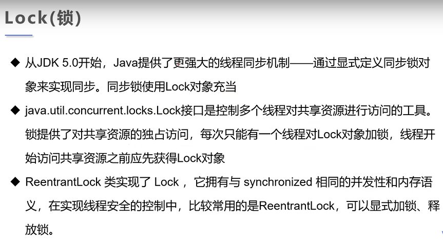

## 第一章 线程简介

### 1.多任务

​	概念：同一时间内有多个任务

### 2.线程(Thread)

​	概念：线程是独立的执行路径

​	分类：线程分为用户线程和守护线程

### 3.进程(Process)

​	概念：进程是进程实体的运行过程，是系统进行资源分配和调度的一个独立单位，由程序段、数据段和PCB(进程控制块)组成进程实体(又称进程映像)，简称进程

​	通俗：在操作系统中运行的程序就是进程

​	特征：并发性、动态性、异步性、独立性

### 4.多线程

​	概念：多条执行路径，主线程和子线程并发交替执行

### 5.注意

​	**(1)在JAVA中，即使没有自己创建线程，后台也会有多个线程，如主线程(即main()，为程序的入口，用于执行整个程序)、GCC线程**

​	**(2)在一个进程中，如果开辟了多个线程，则线程的运行是由调度器安排调度，调度器是与操作系统紧密相关的，先后顺序是不能人为干预的。**

​	**(3)对同一份资源操作，会存在资源抢夺的问题，需要加入并发控制**

​	**(4)线程会带来额外的开销，如CPU调度时间，并发控制开销**

​	**(5)每个线程在自己的工作内存交互，内存控制不当会造成数据不一致**

​	**(6)一个进程可以有多个线程**

## 第二章 JAVA线程创建/实现(重点)

### 1.线程创建

​	(1)继承Thread类

​	(2)实现Runnable接口

​	(3)实现Callable接口

### 2.继承Thread类(重点)

​	(1)过程：首先定义线程类继承Thread类；然后重写run()方法；最后在通过创建该线程类对象并调用start()方法启动线程，执行run()中代码内容

​	(2)启动线程：子类对象.start()

​	(3)不建议使用原因：存在OOP单继承局限问题

​	(4)注意：**JAVA中线程不一定立即执行，是由CPU进行安排调度的**

### 3.实现Runnable接口(重点且推荐)

​	(1)过程：首先定义线程类实现Runnable接口；然后实现run()方法；最后在通过创建该线程类对象和Thread对象，并在Thread构造器中传入该线程实例对象(代理)；调用start()方法启动线程，执行run()中代码内容

​	(2)启动线程：给Thread构造器传入该线程类对象，Thread对象.start()

​	(3)建议使用原因：避免OOP单继承局限问题，灵活方便，方便同一个对象被多个线程使用

### 4.实现Callable接口

​	(1)过程：

​		(a)首先定义线程类实现Callable接口(需要返回值类型)

​		(b)实现call()方法，可以抛出异常

​		(c)创建该线程对象

​		(d)创建执行服务：ExecutorService service = ExecutorService.newFixedThreadPool(1);此参数为线程个数

​		(e)提交执行：Future<Boolean> result1 =  service.submit(该线程对象实例);

​		(f)获取结果：boolean r1 = result1.get();

​		(g)关闭服务：service.shutdownNow();

​	(2)好处：可以定义返回值，可以抛出异常

### 5.静态代理和Thread对比

​	(1)静态代理

​		(a)真实对象和代理对象都要实现同一个接口，代理对象要代理正式对象

​		(b)好处：代理对象可以做很多真实对象做不了的事情，真实对象专注于做自己的事情

​		(c)实例：

​	(2)静态代理和Thread对比：线程类通过实现Runnable接口具备多线程能力，实质上使用了静态代理

### 6.Lambda表达式

​	(1)使用：(params) -> expression[表达式]、(params) -> statememts[语句]、(params) -> {statememts}

​	(2)函数式接口：任何接口中只包含唯一一个抽象方法，那么它就是函数式接口，对于函数式接口，在JAVA中可以通过Lambda表达式来创建该接口对象

​	(3)实例：

​	(4)好处：避免匿名内部类定义过多，让代码更加简洁，去掉无意义的代码从而注重核心逻辑

## 第三章 线程状态

### 1.线程状态

​	(1)线程状态分为：创建、就绪、阻塞、运行、死亡

​	(2)JAVA中线程主要方法：

### 2.线程中止(stop)

​	不推荐使用JDK提供的stop()、destroy()方法，建议使用一个标志位flag和循环n次改flag为false进行终止，例如变量flag=false，线程中止运行：

### 3.线程休眠(sleep)

​	(1)线程通过调用Thread.sleep()进行线程休眠，参数为指定线程阻塞时长，单位为毫秒

​	(2)sleep()方法存在异常InterruptedException，时间到达后线程进入就绪状态

​	(3)sleep()方法可以模拟网络延时(作用：放大问题的发生性)，倒计时等

​	(4)每个对象都有一个锁，sleep()方法不会释放锁

### 4.线程礼让(yield)

​	线程礼让就是通过调用Thread.yield()让当前正在执行的线程暂停，但不阻塞，将线程转为就绪状态，让CPU重新调度(礼让不一定成功，由CPU进行决定)

### 5.线程合并(join)

​	线程合并是通过使用线程实例对象创建后的Thread对象中join()方法让该线程执行，原先和其他线程进入阻塞状态，直到该进程结束

### 6.线程优先级(Priority)

​	(1)知识点：JAVA提供线程调度器来监控程序中启动后进入就绪状态的所有线程，线程调度器按照优先级决定应该调度哪个线程执行(但是优先级高不一定真的先执行，最终由CPU进行决定)

​	(2)线程优先级用数字进行表示，从1~10：

​	(3)通过使用线程实例对象创建后的Thread对象中getPriority()和setPriority()来获取和设置优先级

### 7.守护(Daemon)线程

​	(1)用户线程和守护线程区别：虚拟机必须确保用户线程执行完毕才结束，不必等待守护线程执行完毕才结束

​	(2)守护线程作用：后台记录操作日志、监控内存、垃圾回收等待......

​	(3)在JAVA中通过使用线程实例对象创建后的Thread对象中setDaemon(true)使该线程成为守护线程，默认值为false，即用户线程

## 第四章 线程同步(重点)

### 1.基础知识

​	(1)并发：在同一时间间隔内，同一对象被多个线程操作

​	(2)线程同步可以解决多个线程操作同一资源时出现的问题，当多个线程同时访问该资源时，会进入该资源的等待池形成队列，等待前面线程使用完毕后，下一个线程再使用

​	(3)线程同步形成条件：队列+锁

### 2.队列和锁

​	(1)队列：让多个线程形成一个队列，按照先进先出原则决定谁先获取资源

​	(2)锁：确保某一线程操作资源时，其他在队列中的线程处于等待状态，等到该线程释放锁后，下一个线程才能操作该资源

​	(3)完整描述：由于同一进程中多个线程共享同一个存储空间(资源)，在带来方便的同时，也带来了线程冲突问题，为了保证数据(资源)在方法中被访问时的正确性，在访问时加入了锁机制(synchronized)，当一个线程获得资源的排他锁，独占资源，其他线程必须等待，使用后释放锁即可

​	(4)线程同步导致的问题：

​		(a)一个线程持有锁会导致其他所有需要此锁的线程挂起

​		(b)在多线程竞争的情况下，加锁/释放锁会导致比较多的上下文切换和调度延时，引起性能问题

​		(c)如果一个优先级高的线程等待一个优先级低的线程释放锁，会导致优先级倒置，引起性能问题

​	(5)三大不安全案例

​		(a)不安全买票

​		(b)不安全取钱

​		(c)线程不安全的集合

### 3.线程同步实现	

​	(1)synchronized关键字

​		(a)JAVA中提供同步机制：使用synchronized关键字来实现线程同步

​		(b)用法：synchronized 方法和synchronized 代码块 进行加锁，synchronized 方法锁的其实是对象本身(this)，synchronized 代码块中obj参数必须是要被增删改的参数

​		(c)synchronized控制对该资源的访问，每个对象(资源)对应一把锁，每个由synchronized控制的，线程都必须获取该对象(资源)的锁才能执行，否则线程会阻塞

​		(d)缺陷：若将一个大的方法声明为synchronized将会影响效率(性能问题)

​	(2)Lock接口

​		通过创建ReentrantLock lock(可重用锁)对象，然后在相应位置使用lock.lock()和lock.unlock()加锁和解锁

​	(3)两种方式对比

### 4.JUC并发包

​	(1)CopyOnWriteArrayList集合类

### 5.死锁

​	(1)概念：如果一组线程中，每个线程(或进程)都在等待仅由该组线程(或进程)中其他线程(或进程)占有的资源才能运行，即导致该组线程(或进程)所有线程(或进程)都在等待其他线程(或进程)释放资源，则称此事件为死锁。

​	(2)产生死锁的四个必要条件：

​		(a)互斥条件：一个资源每次只能被一个进程使用

​		(b)请求与保持条件：一个线程(或进程)因请求资源阻塞时，不释放已获取的资源

​		(c)不剥夺条件：线程(或进程)已获得的资源，在未使用完之前，不能强行剥夺

​		(d)循环等待条件：若干进程之间形成一种头尾相接的循环等待资源关系

## 第五章 线程通信

### 1.生产者消费者问题

​	(1)假设仓库中只能存放一件产品，生产者将生产出来的产品放入仓库，消费者从仓库中取走产品进行消费

​	(2)如果仓库中没有产品，则生产者开始生产并将产品放入库中，否则停止生产并等待，直到仓库中的产品被消费者取走为止

​	(3)如果仓库中放有产品，则消费者可以取走产品进行消费，否则停止消费并等待，直到生产者将产品放入仓库中为止

### 2.JAVA中提供几种线程通信的方法

​	(1)wait()：表示线程一直在等待，直到其他线程通知，与sleep()不同，会释放锁

​	(2)wait(毫秒数)：指定等待的毫秒数

​	(3)notify()：唤醒一个正在等待状态的线程

​	(4)notifyAll()：唤醒同一个对象上所有调用wait()方法的线程，优先级高的线程优先调度

### 3.实现线程通信方式

## 第六章 进阶内容

### 1.线程池

​	(1)背景：经常创建和销毁，使用量特别大的资源，比如并发情况下的线程，对性能影响很大

​	(2)思路：提前创建好多个线程，放入线程池，使用直接获取，使用完放回线程池中。可以避免频繁地创建和销毁，实现重复利用。

​	(3)好处：(a)提高响应速度(减少了创建新线程的时间)；(b)降低资源消耗(重复利用线程池中的线程，不需要每次都重新创建)；(c)便于线程管理：corePoolSize(核心池/线程池大小)、maximumPoolSize(同一时间最大线程数)、keepAliveTime(线程没有任务时最多保持多长时间会终止)

​	(4)JAVA提供的类：

