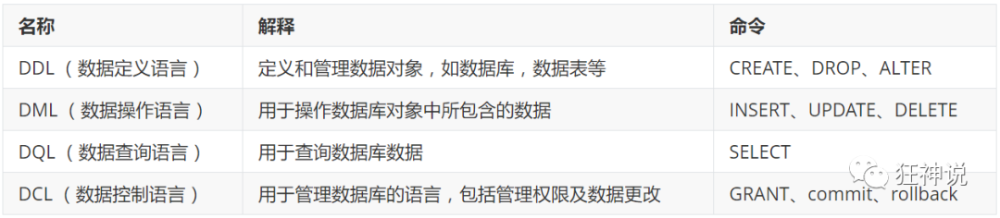
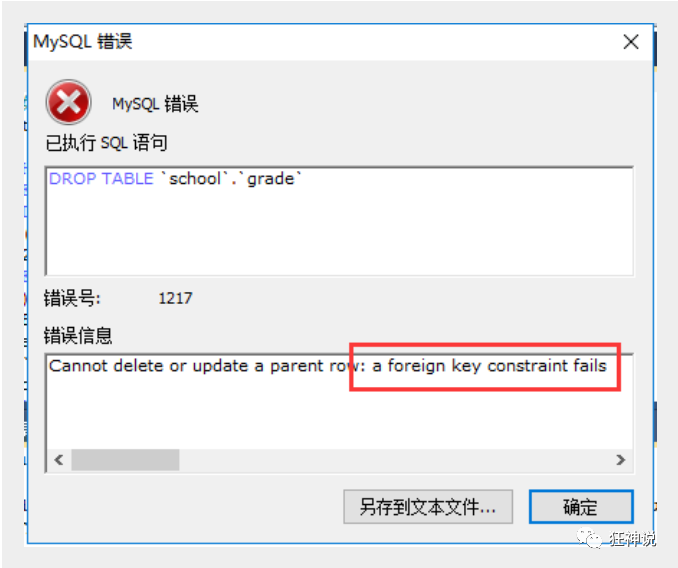

## 第一章 初识Mysql

### 第一点：为什么学习数据库

1、岗位技能需求

2、现在的世界,得数据者得天下

3、存储数据的方法

4、程序,网站中,大量数据如何长久保存?

5、**数据库是几乎软件体系中最核心的一个存在。**

### 第二点：什么是数据库

数据库 ( **DataBase** , 简称**DB** )

**概念** : 长期存放在计算机内,有组织,可共享的大量数据的集合,是一个数据 "仓库"

**作用** : 保存,并能安全管理数据(如:增删改查等),减少冗余...

**数据库总览 :**

- 关系型数据库 ( SQL )
- - MySQL , Oracle , SQL Server , SQLite , DB2 , ...
  - 关系型数据库通过外键关联来建立表与表之间的关系
- 非关系型数据库 ( NOSQL )
- - Redis , MongoDB , ...
  - 非关系型数据库通常指数据以对象的形式存储在数据库中，而对象之间的关系通过每个对象自身的属性来决定

### 第三点：什么是DBMS

数据库管理系统 ( **D**ata**B**ase **M**anagement **S**ystem )

数据库管理软件 , 科学组织和存储数据 , 高效地获取和维护数据


为什么要说这个呢?

因为我们要学习的MySQL应该算是一个数据库管理系统.

> MySQL简介


**概念 :** 是现在**流行**的**开源**的,**免费**的 **关系型**数据库

**历史 :** 由瑞典MySQL AB 公司开发，目前属于 Oracle 旗下产品。

**特点 :**

- 免费 , 开源数据库
- 小巧 , 功能齐全
- 使用便捷
- 可运行于Windows或Linux操作系统
- 可适用于中小型甚至大型网站应用

**官网 :** **https://www.mysql.com/**

### 第四点：安装MySQL

> 安装步骤

mysql5.7 64位下载地址:

https://dev.mysql.com/get/Downloads/MySQL-5.7/mysql-5.7.19-winx64.zip

1、下载后得到zip压缩包.

2、解压到自己想要安装到的目录，本人解压到的是D:\Environment\mysql-5.7.19

3、添加环境变量：我的电脑->属性->高级->环境变量

```php
选择PATH,在其后面添加: 你的mysql 安装文件下面的bin文件夹
```

4、编辑 my.ini 文件 ,注意替换路径位置

```php
[mysqld]
basedir=D:\Program Files\mysql-5.7\
datadir=D:\Program Files\mysql-5.7\data\
port=3306
skip-grant-tables
```

5、启动管理员模式下的CMD，并将路径切换至mysql下的bin目录，然后输入mysqld –install (安装mysql)

6、再输入  mysqld --initialize-insecure --user=mysql 初始化数据文件

7、然后再次启动mysql 然后用命令 mysql –u root –p 进入mysql管理界面（密码可为空）

8、进入界面后更改root密码

```php
update mysql.user set authentication_string=password('123456') where user='root' and Host = 'localhost';
```

9、刷新权限

```php
flush privileges;
```

10、修改 my.ini文件删除最后一句skip-grant-tables

11、重启mysql即可正常使用

```php
net stop mysql
net start mysql
```

12、连接上测试出现以下结果就安装好了


> SQLyog

可手动操作,管理MySQL数据库的软件工具

特点 : 简洁 , 易用 , 图形化


使用SQLyog管理工具自己完成以下操作 :

- 连接本地MySQL数据库
- 新建MySchool数据库
- - 字段
  - GradeID : int(11) , Primary Key (pk)
  - GradeName : varchar(50)
  - 数据库名称MySchool
  - 新建数据库表(grade)

在历史记录中可以看到相对应的数据库操作的语句 .

> 连接数据库

打开MySQL命令窗口

- 在DOS命令行窗口进入 **安装目录\mysql\bin**
- 可设置环境变量，设置了环境变量，可以在任意目录打开！

**连接数据库语句 :** mysql -h 服务器主机地址 -u 用户名 -p 用户密码

注意 : -p后面不能加空格,否则会被当做密码的内容,导致登录失败 !

### **第五点：常见数据库操作命令 **

```mysql
update user set password=password('123456')where user='root'; 修改密码
flush privileges;  刷新数据库
show databases; 显示所有数据库
use dbname；打开某个数据库
show tables; 显示数据库mysql中所有的表
describe/DESC user; 显示表mysql数据库中user表的列信息
create database name; 创建数据库
use databasename; 选择数据库
exit; 退出Mysql
? 命令关键词 : 寻求帮助
-- 表示注释
show create database/table 库名/表名 --显示创建数据库或者表的定义语句

注意：字符串需要使用单引号括起来
```

### 第六点：结构化查询语句分类




## 第二章 Mysql数据定义(DDL)

### 第一点：数据库操作

> 命令行操作数据库

创建数据库 :  create database [if not exists] 数据库名;

删除数据库 : drop database [if exists] 数据库名;

查看数据库 : show databases;

使用数据库 : use 数据库名;

> 对比工具操作数据库

**学习方法：**

- 对照SQLyog工具自动生成的语句学习
- 固定语法中的单词需要记忆
- 

### 第二点：创建数据表

属于DDL的一种，语法 :

```mysql
create table [if not exists] `表名`(
    '字段名1' 列类型 [属性][索引][注释],
    '字段名2' 列类型 [属性][索引][注释],
    #...
    '字段名n' 列类型 [属性][索引][注释]
)[表类型][表字符集][注释];
```

**说明 : 反引号用于区别MySQL保留字与普通字符而引入的 (键盘esc下面的键).*****

### 第三点：数据值和列类型

列类型 : 规定数据库中该列存放的数据类型

> 数值类型


> 字符串类型


> 日期和时间型数值类型


> NULL值

- 理解为 "没有值" 或 "未知值"
- 不要用NULL进行算术运算 , 结果仍为NULL

### 第四点：数据字段属性

**UnSigned**

- 无符号的
- 声明该数据列不允许负数 .

**ZEROFILL**

- 0填充的
- 不足位数的用0来填充 , 如int(3),5则为005

**Auto_InCrement**

- 自动增长的 , 每添加一条数据 , 自动在上一个记录数上加 1(默认)
- 通常用于设置**主键** , 且为整数类型
- 可定义起始值和步长
  - 当前表设置步长(AUTO_INCREMENT=100) : 只影响当前表
  - SET @@auto_increment_increment=5 ; 影响所有使用自增的表(全局)

**NULL 和 NOT NULL**

- 默认为NULL , 即没有插入该列的数值
- 如果设置为NOT NULL , 则该列必须有值

**DEFAULT**

- 默认的
- 用于设置默认值
- 例如,性别字段,默认为"男" , 否则为 "女" ; 若无指定该列的值 , 则默认值为"男"的值

```php
-- 目标 : 创建一个school数据库
-- 创建学生表(列,字段)
-- 学号int 登录密码varchar(20) 姓名,性别varchar(2),出生日期(datatime),家庭住址,email
-- 创建表之前 , 一定要先选择数据库
CREATE TABLE IF NOT EXISTS `student` (
  `id` int(4) NOT NULL AUTO_INCREMENT COMMENT '学号',
  `name` varchar(30) NOT NULL DEFAULT '匿名' COMMENT '姓名',
  `pwd` varchar(20) NOT NULL DEFAULT '123456' COMMENT '密码',
  `sex` varchar(2) NOT NULL DEFAULT '男' COMMENT '性别',
  `birthday` datetime DEFAULT NULL COMMENT '生日',
  `address` varchar(100) DEFAULT NULL COMMENT '地址',
  `email` varchar(50) DEFAULT NULL COMMENT '邮箱',
   PRIMARY KEY (`id`)
) ENGINE=InnoDB DEFAULT CHARSET=utf8

-- 查看数据库的定义
SHOW CREATE DATABASE school;
-- 查看数据表的定义
SHOW CREATE TABLE student;
-- 显示表结构
DESC student;  -- 设置严格检查模式(不能容错了)SET sql_mode='STRICT_TRANS_TABLES';
```

### 第五点：数据表的类型

> 设置数据表引擎的类型

```mysql
CREATE TABLE 表名(
)ENGINE = MyISAM (or InnoDB)
    
-- 查看mysql所支持的引擎类型 (表类型)
SHOW ENGINES;
```

MySQL的数据表的类型 : **MyISAM** , **InnoDB** , HEAP , BOB , CSV等...

常见的 MyISAM 与 InnoDB 类型：


经验 ( 适用场合 )  :

- 适用 MyISAM : 节约空间及相应速度
- 适用 InnoDB : 安全性 , 事务处理及多用户操作数据表

> 数据表的存储位置

- MySQL数据表以文件方式存放在磁盘中

  - 包括表文件 , 数据文件 , 以及数据库的选项文件
  - 位置 : Mysql安装目录\data\下存放数据表 . 目录名对应数据库名 , 该目录下文件名对应数据表 .

- 注意 :

  - \* . frm -- 表结构定义文件

  - \* . MYD -- 数据文件 ( data )

  - \* . MYI -- 索引文件 ( index )

  - InnoDB类型数据表只有一个 *.frm文件 , 以及上一级目录的ibdata1文件

  - MyISAM类型数据表对应三个文件 :

    

> 设置数据表字符集

我们可为数据库,数据表,数据列设定不同的字符集，设定方法 :

- 创建时通过命令来设置 , 如 : CREATE TABLE 表名()CHARSET = utf8;
- 如无设定 , 则根据MySQL数据库配置文件 my.ini 中的参数设定

### 第六点：修改数据库

> 修改表 ( ALTER TABLE )

修改表名 :ALTER TABLE 旧表名 RENAME AS 新表名

添加字段 : ALTER TABLE 表名 ADD字段名 列属性[属性]

修改字段 :

- ALTER TABLE 表名 MODIFY 字段名 列类型[属性]
- ALTER TABLE 表名 CHANGE 旧字段名 新字段名 列属性[属性]

删除字段 :  ALTER TABLE 表名 DROP 字段名

> 删除数据表

语法：DROP TABLE [IF EXISTS] 表名

- IF EXISTS为可选 , 判断是否存在该数据表
- 如删除不存在的数据表会抛出错误

> 其他

```php
1. 可用反引号（`）为标识符（库名、表名、字段名、索引、别名）包裹，以避免与关键字重名！中文也可以作为标识符！
2. 每个库目录存在一个保存当前数据库的选项文件db.opt。
3. 注释：
 	单行注释 # 注释内容
    多行注释 /* 注释内容 */
    单行注释 -- 注释内容        (标准SQL注释风格，要求双破折号后加一空格符（空格、TAB、换行等）)
4. 模式通配符：
    _    任意单个字符
    %    任意多个字符，甚至包括零字符
    单引号需要进行转义 \'
5. CMD命令行内的语句结束符可以为 ";", "\G", "\g"，仅影响显示结果。其他地方还是用分号结束。delimiter 可修改当前对话的语句结束符。
6. SQL对大小写不敏感 （关键字）
7. 清除已有语句：\c
```


## 第三章 Mysql数据操作(DML)

### 第一点：外键

> 外键概念

如果公共关键字在一个关系中是主关键字，那么这个公共关键字被称为另一个关系的外键。由此可见，外键表示了两个关系之间的相关联系。以另一个关系的外键作主关键字的表被称为**主表**，具有此外键的表被称为主表的**从表**。

在实际操作中，将一个表的值放入第二个表来表示关联，所使用的值是第一个表的主键值(在必要时可包括复合主键值)。此时，第二个表中保存这些值的属性称为外键(**foreign key**)。

**外键作用**

保持数据**一致性**，**完整性**，主要目的是控制存储在外键表中的数据,**约束**。使两张表形成关联，外键只能引用外表中的列的值或使用空值。

> 创建外键

建表时指定外键约束

```mysql
-- 创建外键的方式一 : 创建子表同时创建外键
-- 年级表 (id\年级名称)
CREATE TABLE `grade` (
  `gradeid` INT(10) NOT NULL AUTO_INCREMENT COMMENT '年级ID',
  `gradename` VARCHAR(50) NOT NULL COMMENT '年级名称',
  PRIMARY KEY (`gradeid`)
) ENGINE=INNODB DEFAULT CHARSET=utf8
-- 学生信息表 (学号,姓名,性别,年级,手机,地址,出生日期,邮箱,身份证号)
CREATE TABLE `student` (
  `studentno` INT(4) NOT NULL COMMENT '学号',
  `studentname` VARCHAR(20) NOT NULL DEFAULT '匿名' COMMENT '姓名',
  `sex` TINYINT(1) DEFAULT '1' COMMENT '性别',
  `gradeid` INT(10) DEFAULT NULL COMMENT '年级',
  `phoneNum` VARCHAR(50) NOT NULL COMMENT '手机',
  `address` VARCHAR(255) DEFAULT NULL COMMENT '地址',
  `borndate` DATETIME DEFAULT NULL COMMENT '生日',
  `email` VARCHAR(50) DEFAULT NULL COMMENT '邮箱',
  `idCard` VARCHAR(18) DEFAULT NULL COMMENT '身份证号',
  PRIMARY KEY (`studentno`),
  KEY `FK_gradeid` (`gradeid`),
  CONSTRAINT `FK_gradeid` FOREIGN KEY (`gradeid`) REFERENCES `grade` (`gradeid`)
) ENGINE=INNODB DEFAULT CHARSET=utf8
```

建表后修改

```mysql
-- 创建外键方式二 : 创建子表完毕后,修改子表添加外键
ALTER TABLE `student`
ADD CONSTRAINT `FK_gradeid` FOREIGN KEY (`gradeid`) REFERENCES `grade` (`gradeid`);
```

> 删除外键

操作：删除 grade 表，发现报错



**注意** : 删除具有主外键关系的表时 , 要先删子表 , 后删主表

```php
-- 删除外键
ALTER TABLE student DROP FOREIGN KEY FK_gradeid;
-- 发现执行完上面的,索引还在,所以还要删除索引
-- 注:这个索引是建立外键的时候默认生成的
ALTER TABLE student DROP INDEX FK_gradeid;
```

### 第二点：DML语言

**数据库意义** ： 数据存储、数据管理

**管理数据库数据方法：**

- 通过SQLyog等管理工具管理数据库数据
- 通过**DML语句**管理数据库数据

**DML语言**  ：数据操作语言

- 用于操作数据库对象中所包含的数据
- 包括 :
  - INSERT (添加数据语句)
  - UPDATE (更新数据语句)
  - DELETE (删除数据语句)

### 第三点：添加数据

> INSERT命令

**语法：**

```php
INSERT INTO 表名[(字段1,字段2,字段3,...)] VALUES('值1','值2','值3')
```

**注意 :**

- 字段或值之间用英文逗号隔开 .
- ' 字段1,字段2...' 该部分可省略 , 但添加的值务必与表结构,数据列,顺序相对应,且数量一致 .
- 可同时插入多条数据 , values 后用英文逗号隔开 .

```mysql
-- 使用语句如何增加语句?
-- 语法 : INSERT INTO 表名[(字段1,字段2,字段3,...)] VALUES('值1','值2','值3');
INSERT INTO grade(gradename) VALUES ('大一');

-- 主键自增,那能否省略呢?
INSERT INTO grade VALUES ('大二');
-- 查询:INSERT INTO grade VALUE ('大二')错误代码：1136
Column count doesn`t match value count at row 1
-- 结论:'字段1,字段2...'该部分可省略 , 但添加的值务必与表结构,数据列,顺序相对应,且数量一致.
-- 一次插入多条数据
INSERT INTO grade(gradename) VALUES ('大三'),('大四');
```

### 第四点：修改数据

> update命令

语法：

```php
UPDATE 表名 SET column_name=value [,column_name2=value2,...] [WHERE condition];
```

**注意 :**

- column_name 为要更改的数据列
- value 为修改后的数据 , 可以为变量 , 具体指 , 表达式或者嵌套的SELECT结果
- condition 为筛选条件 , 如不指定则修改该表的所有列数据

> where条件子句

可以简单的理解为 : 有条件地从表中筛选数据

测试：

```mysql
-- 修改年级信息
UPDATE grade SET gradename = '高中' WHERE gradeid = 1;
```

### 第五点：删除数据

> DELETE命令

语法：

```php
DELETE FROM 表名 [WHERE condition];
```

注意：condition为筛选条件 , 如不指定则删除该表的所有列数据

```mysql
-- 删除最后一个数据
DELETE FROM grade WHERE gradeid = 5
```

> TRUNCATE命令

作用：用于完全清空表数据 , 但表结构 , 索引 , 约束等不变 ;

语法：

```mysql
TRUNCATE [TABLE] table_name;
-- 清空年级表
TRUNCATE grade
```

**注意：区别于DELETE命令**

- 相同 : 都能删除数据 , 不删除表结构 , 但TRUNCATE速度更快
- 不同 :
  - 使用TRUNCATE TABLE 重新设置AUTO_INCREMENT计数器
  - 使用TRUNCATE TABLE不会对事务有影响


## 第四章 Mysql数据查询(DQL)

### 第一点：DQL语言

**DQL( Data Query Language 数据查询语言 )**

- 查询数据库数据 , 如**SELECT**语句
- 简单的单表查询或多表的复杂查询和嵌套查询
- 是数据库语言中最核心,最重要的语句
- 使用频率最高的语句

> ***SELECT*语法**

```mysql
SELECT [ALL | DISTINCT(去重)]
{* | table.* | [table.field1[as alias1][,table.field2[as alias2]][,...]]}
FROM table_name [as table_alias]
    [left | right | inner join table_name2]  -- 联合查询
    [WHERE ...]  -- 指定结果需满足的条件
    [GROUP BY ...]  -- 指定结果按照哪几个字段来分组
    [HAVING]  -- 过滤分组的记录必须满足的次要条件
    [ORDER BY ...]  -- 指定查询记录按一个或多个条件排序
    [LIMIT {[offset,]row_count | row_countOFFSET offset}];
    --  指定查询的记录从哪条至哪条
```

**注意 : [ ] 括号代表可选的 , { }括号代表必选得**

### 第二点：指定查询字段

```mysql
-- 查询表中所有的数据列结果 , 采用 **" \* "** 符号; 但是效率低，不推荐 .
-- 查询所有学生信息
SELECT * FROM student;

-- 查询指定列(学号 , 姓名)
SELECT studentno,studentname FROM student;
```

> AS 子句作为别名(可省略)

作用：

- 可给数据列取一个新别名
- 可给表取一个新别名
- 可把经计算或总结的结果用另一个新名称来代替

```mysql
-- 这里是为列取别名(当然as关键词可以省略)
SELECT studentno AS 学号,studentname AS 姓名 FROM student;

-- 使用as也可以为表取别名
SELECT studentno AS 学号,studentname AS 姓名 FROM student AS s;

-- 使用as,为查询结果取一个新名字
-- CONCAT()函数拼接字符串
SELECT CONCAT('姓名:',studentname) AS 新姓名 FROM student;
```

> DISTINCT关键字的使用

作用 : 去掉SELECT查询返回的记录结果中重复的记录 ( 返回所有列的值都相同 ) , 只返回一条

```mysql
-- # 查看哪些同学参加了考试(学号)  去除重复项
SELECT * FROM result; -- 查看考试成绩
SELECT studentno FROM result; --  查看哪些同学参加了考试
SELECT DISTINCT studentno FROM result; -- 了解:DISTINCT 去除重复项 , (默认是ALL)
```

> 使用表达式的列

数据库中的表达式 : 一般由文本值 , 列值 , NULL , 函数和操作符等组成

应用场景 :

- SELECT语句返回结果列中使用

- SELECT语句中的ORDER BY , HAVING等子句中使用

- DML语句中的 where 条件语句中使用表达式

  ```mysql
  -- selcet查询中可以使用表达式
  SELECT @@auto_increment_increment; -- 查询自增步长
  SELECT VERSION(); -- 查询版本号
  SELECT 100*3-1 AS 计算结果; -- 表达式
  
  -- 学员考试成绩集体提分一分查看
  SELECT studentno,StudentResult+1 AS '提分后' FROM result;
  ```

- 避免SQL返回结果中包含 ' . ' , ' * ' 和括号等干扰开发语言程序.

### 第三点：where条件语句

作用：用于检索数据表中 符合条件 的记录

搜索条件可由一个或多个逻辑表达式组成 , 结果一般为真或假.

> 逻辑操作符


测试

```mysql
-- 满足条件的查询(where)
SELECT Studentno,StudentResult FROM result;

-- 查询考试成绩在95-100之间的
SELECT Studentno,StudentResult
FROM result
WHERE StudentResult>=95 AND StudentResult<=100;

-- AND也可以写成 &&
SELECT Studentno,StudentResult
FROM result
WHERE StudentResult>=95 && StudentResult<=100;

-- 模糊查询(对应的词:精确查询)
SELECT Studentno,StudentResult
FROM result
WHERE StudentResult BETWEEN 95 AND 100;

-- 除了1000号同学,要其他同学的成绩
SELECT studentno,studentresult
FROM result
WHERE studentno!=1000;

-- 使用NOT
SELECT studentno,studentresult
FROM result
WHERE NOT studentno=1000;
```

> 模糊查询 ：比较操作符


注意：

- 数值数据类型的记录之间才能进行算术运算 ;
- 相同数据类型的数据之间才能进行比较 ;

测试：

```mysql
-- 模糊查询 between and \ like \ in \ null
-- =============================================
-- LIKE
-- =============================================
    
-- 查询姓刘的同学的学号及姓名
-- like结合使用的通配符 : % (代表0到任意个字符)  _ (一个字符)
SELECT studentno,studentname FROM student
WHERE studentname LIKE '刘%';

-- 查询姓刘的同学,后面只有一个字的
SELECT studentno,studentname FROM student
WHERE studentname LIKE '刘_';

-- 查询姓刘的同学,后面只有两个字的
SELECT studentno,studentname FROM student
WHERE studentname LIKE '刘__';

-- 查询姓名中含有 嘉 字的
SELECT studentno,studentname FROM student
WHERE studentname LIKE '%嘉%';

-- 查询姓名中含有特殊字符的需要使用转义符号 '\'
-- 自定义转义符关键字:  ESCAPE ':'

-- =============================================
-- IN
-- =============================================
-- 查询学号为1000,1001,1002的学生姓名
SELECT studentno,studentname FROM student
WHERE studentno IN (1000,1001,1002);

-- 查询地址在北京,南京,河南洛阳的学生
SELECT studentno,studentname,address FROM student
WHERE address IN ('北京','南京','河南洛阳');

-- =============================================
-- NULL 空
-- =============================================
-- 查询出生日期没有填写的同学
-- 不能直接写=NULL , 这是代表错误的 , 用 is null
SELECT studentname FROM student
WHERE BornDate IS NULL;

-- 查询出生日期填写的同学
SELECT studentname FROM student
WHERE BornDate IS NOT NULL;

-- 查询没有写家庭住址的同学(空字符串不等于null)
SELECT studentname FROM student
WHERE Address='' OR Address IS NULL;
```

```
exists 和 in 的区别：
	1、exists是对外表做loop循环，每次loop循环再对内表（子查询）进行查询，那么因为对内表的查询使用的索引（内表效率高，故可用大表），而外表有多大都需要遍历，不可避免（尽量用小表），故内表大的使用exists，可加快效率；
	2、in是把外表和内表做hash连接，先查询内表，再把内表结果与外表匹配，对外表使用索引（外表效率高，可用大表），而内表多大都需要查询，故外表大的使用in，可加快效率。
	3、如果用not in ，则是内外表都全表扫描，无索引，效率低，可考虑使用not exists，也可使用A left join B on A.id=B.id where B.id is null 进行优化。
```

### 第四点：连接查询

> JOIN 对比


七种Join：


测试

```mysql
/*
连接查询
    如需要多张数据表的数据进行查询,则可通过连接运算符实现多个查询
内连接 inner join
    查询两个表中的结果集中的交集
外连接 outer join
    左外连接 left join
        (以左表作为基准,右边表来一一匹配,匹配不上的,返回左表的记录,右表以NULL填充)
    右外连接 right join
        (以右表作为基准,左边表来一一匹配,匹配不上的,返回右表的记录,左表以NULL填充)
等值连接和非等值连接
自连接
*/

-- 查询参加了考试的同学信息(学号,学生姓名,科目编号,分数)
SELECT * FROM student;
SELECT * FROM result;
/*思路:
(1):分析需求,确定查询的列来源于两个类,student  result,连接查询
(2):确定使用哪种连接查询?(内连接)
*/

SELECT s.studentno,studentname,subjectno,StudentResult
FROM student s
INNER JOIN result r
ON r.studentno = s.studentno

-- 右连接(也可实现)
SELECT s.studentno,studentname,subjectno,StudentResult
FROM student s
RIGHT JOIN result r
ON r.studentno = s.studentno

-- 等值连接
SELECT s.studentno,studentname,subjectno,StudentResult
FROM student s , result r
WHERE r.studentno = s.studentno

-- 左连接 (查询了所有同学,不考试的也会查出来)
SELECT s.studentno,studentname,subjectno,StudentResult
FROM student s
LEFT JOIN result r
ON r.studentno = s.studentno
```

> 自连接(例如使用在评论和回复中)

```mysql
/*
自连接
    数据表与自身进行连接
需求:从一个包含栏目ID , 栏目名称和父栏目ID的表中
     查询父栏目名称和其他子栏目名称
*/
-- 创建一个表
CREATE TABLE `category` (
  `categoryid` INT(10) UNSIGNED NOT NULL AUTO_INCREMENT COMMENT '主题id',
  `pid` INT(10) NOT NULL COMMENT '父id',
  `categoryName` VARCHAR(50) NOT NULL COMMENT '主题名字',  
   PRIMARY KEY (`categoryid`)
) ENGINE=INNODB AUTO_INCREMENT=9 DEFAULT CHARSET=utf8

-- 编写SQL语句,将栏目的父子关系呈现出来 (父栏目名称,子栏目名称)
-- 核心思想:把一张表看成两张一模一样的表,然后将这两张表连接查询(自连接)

SELECT a.categoryName AS '父栏目',b.categoryName AS '子栏目'
FROM category AS a,category AS b
WHERE a.`categoryid`=b.`pid`

-- 思考题:查询参加了考试的同学信息(学号,学生姓名,科目名,分数)
SELECT s.studentno,studentname,subjectname,StudentResult
FROM student s
INNER JOIN result r
ON r.studentno = s.studentno
INNER JOIN `subject` sub
ON sub.subjectno = r.subjectno

```

### 第五点：排序和分页

测试

```mysql
/*============== 排序 ================
语法 : ORDER BY
    ORDER BY 语句用于根据指定的列对结果集进行排序。
    ORDER BY 语句默认按照ASC升序对记录进行排序。
    如果您希望按照降序对记录进行排序，可以使用 DESC 关键字。
*/

-- 查询 数据库结构-1 的所有考试结果(学号 学生姓名 科目名称 成绩)
-- 按成绩降序排序
SELECT s.studentno,studentname,subjectname,StudentResult
FROM student s
INNER JOIN result r
ON r.studentno = s.studentno
INNER JOIN `subject` sub
ON r.subjectno = sub.subjectno
WHERE subjectname='数据库结构-1'
ORDER BY StudentResult DESC

/*============== 分页 ================
语法 : SELECT * FROM table LIMIT [offset,] rows | rows OFFSET offset
好处 : (用户体验,网络传输,查询压力)
推导:
    第一页 : limit 0,5
	第二页 : limit 5,5
    ......
    第N页 : limit (pageNo-1)*pageSzie,pageSzie
    [pageNo:页码,pageSize:单页面显示条数]
*/

-- 每页显示5条数据
SELECT s.studentno,studentname,subjectname,StudentResult
FROM student s
INNER JOIN result r
ON r.studentno = s.studentno
INNER JOIN `subject` sub
ON r.subjectno = sub.subjectno
WHERE subjectname='数据库结构-1'
ORDER BY StudentResult DESC , studentno
LIMIT 0,5
```

### 第六点：子查询

```mysql
/*============== 子查询 ================
什么是子查询?
    在查询语句中的WHERE条件子句中,又嵌套了另一个查询语句
    嵌套查询可由多个子查询组成,求解的方式是由里及外;
    子查询返回的结果一般都是集合,故而建议使用IN关键字;
*/
-- 查询 数据库结构-1 的所有考试结果(学号,科目编号,成绩),并且成绩降序排列

-- 方法一:使用连接查询
SELECT studentno,r.subjectno,StudentResult
FROM result r
INNER JOIN `subject` sub
ON r.`SubjectNo`=sub.`SubjectNo`
WHERE subjectname = '数据库结构-1'
ORDER BY studentresult DESC;

-- 方法二:使用子查询(执行顺序:由里及外)
SELECT studentno,subjectno,StudentResult
FROM result
WHERE subjectno=(
    SELECT subjectno FROM `subject`
    WHERE subjectname = '数据库结构-1'
)
ORDER BY studentresult DESC;
```

## 第五章 Mysql函数

### 第一点：常用函数

**数据函数**

```mysql
 SELECT ABS(-8);  /*绝对值*/
 SELECT CEILING(9.4); /*向上取整*/
 SELECT FLOOR(9.4);   /*向下取整*/
 SELECT RAND();  /*随机数,返回一个0-1之间的随机数*/
 SELECT SIGN(0); /*符号函数: 负数返回-1,正数返回1,0返回0*/
```

**字符串函数**

```mysql
 SELECT CHAR_LENGTH('狂神说坚持就能成功'); /*返回字符串包含的字符数*/
 SELECT CONCAT('我','爱','程序');  /*合并字符串,参数可以有多个*/
 SELECT INSERT('我爱编程helloworld',1,2,'超级热爱');  /*替换字符串,从某个位置开始替换某个长度*/
 SELECT LOWER('KuangShen'); /*小写*/
 SELECT UPPER('KuangShen'); /*大写*/
 SELECT LEFT('hello,world',5);   /*从左边截取*/
 SELECT RIGHT('hello,world',5);  /*从右边截取*/
 SELECT REPLACE('狂神说坚持就能成功','坚持','努力');  /*替换字符串*/
 SELECT SUBSTR('狂神说坚持就能成功',4,6); /*截取字符串,开始和长度*/
 SELECT REVERSE('狂神说坚持就能成功'); /*反转
 -- 查询姓周的同学,改成邹
 SELECT REPLACE(studentname,'周','邹') AS 新名字
 FROM student WHERE studentname LIKE '周%';
```

**日期和时间函数**

```mysql
 SELECT CURRENT_DATE();   /*获取当前日期*/
 SELECT CURDATE();   /*获取当前日期*/
 SELECT NOW();   /*获取当前日期和时间*/
 SELECT LOCALTIME();   /*获取当前日期和时间*/
 SELECT SYSDATE();   /*获取当前日期和时间*/

 -- 获取年月日,时分秒
 SELECT YEAR(NOW());
 SELECT MONTH(NOW());
 SELECT DAY(NOW());
 SELECT HOUR(NOW());
 SELECT MINUTE(NOW());
 SELECT SECOND(NOW());
```

**系统信息函数**

```mysql
 SELECT VERSION();  /*版本*/
 SELECT USER();     /*用户*/ 
```

### 第二点：聚合函数

| 函数名称 | 描述                                                         |
| :------- | :----------------------------------------------------------- |
| COUNT()  | 返回满足Select条件的记录总和数，如 select count(*) 【不建议使用 *，效率低】 |
| SUM()    | 返回数字字段或表达式列作统计，返回一列的总和。               |
| AVG()    | 通常为数值字段或表达列作统计，返回一列的平均值               |
| MAX()    | 可以为数值字段，字符字段或表达式列作统计，返回最大的值。     |
| MIN()    | 可以为数值字段，字符字段或表达式列作统计，返回最小的值。     |

```mysql
 -- 聚合函数
 /*COUNT:非空的*/
 SELECT COUNT(studentname) FROM student;
 SELECT COUNT(*) FROM student;
 SELECT COUNT(1) FROM student;  /*推荐*/
 -- 从含义上讲，count(1) 与 count(*) 都表示对全部数据行的查询。
 -- count(字段) 会统计该字段在表中出现的次数，忽略字段为null 的情况。即不统计字段为null 的记录。
 -- count(*) 包括了所有的列，相当于行数，在统计结果的时候，包含字段为null 的记录；
 -- count(1) 用1代表代码行，在统计结果的时候，包含字段为null 的记录。
 /*
 很多人认为count(1)执行的效率会比count(*)高，原因是count(*)会存在全表扫描，而count(1)可以针对一个字段进行查询。其实不然，count(1)和count(*)都会对全表进行扫描，统计所有记录的条数，包括那些为null的记录，因此，它们的效率可以说是相差无几。而count(字段)则与前两者不同，它会统计该字段不为null的记录条数。
 下面它们之间的一些对比：
 1）在表没有主键时，count(1)比count(*)快；
 2）有主键时，主键作为计算条件，count(主键)效率最高；
 3）若表格只有一个字段，则count(*)效率较高。
 */
 SELECT SUM(StudentResult) AS 总和 FROM result;
 SELECT AVG(StudentResult) AS 平均分 FROM result;
 SELECT MAX(StudentResult) AS 最高分 FROM result;
 SELECT MIN(StudentResult) AS 最低分 FROM result;
```


## 第六章 数据库事务和索引

### 第一点：事务

> 什么是事务

- 事务就是将一组SQL语句放在同一批次内去执行
- 如果一个SQL语句出错,则该批次内的所有SQL都将被取消执行
- MySQL事务处理只支持InnoDB和BDB数据表类型

> 事务的ACID原则

**原子性(Atomic)**

- 整个事务中的所有操作，要么全部完成，要么全部不完成，不可能停滞在中间某个环节。事务在执行过程中发生错误，会被回滚（ROLLBACK）到事务开始前的状态，就像这个事务从来没有执行过一样。

**一致性(Consist)**

- 一个事务可以封装状态改变（除非它是一个只读的）。事务必须始终保持系统处于一致的状态，不管在任何给定的时间并发事务有多少。也就是说：如果事务是并发多个，系统也必须如同串行事务一样操作。其主要特征是保护性和不变性(Preserving an Invariant)，以转账案例为例，假设有五个账户，每个账户余额是100元，那么五个账户总额是500元，如果在这个5个账户之间同时发生多个转账，无论并发多少个，比如在A与B账户之间转账5元，在C与D账户之间转账10元，在B与E之间转账15元，五个账户总额也应该还是500元，这就是保护性和不变性。

**隔离性(Isolated)**

- 隔离状态执行事务，使它们好像是系统在给定时间内执行的唯一操作。如果有两个事务，运行在相同的时间内，执行相同的功能，事务的隔离性将确保每一事务在系统中认为只有该事务在使用系统。这种属性有时称为串行化，为了防止事务操作间的混淆，必须串行化或序列化请求，使得在同一时间仅有一个请求用于同一数据。

- 执行多个事务时，如果没有有效的避免机制，则会出现以下问题：

  1、**第一类丢失更新（Lost Update）**：在完全未隔离事务的情况下，两个事务更新同一条数据资源，某一事务完成，另一事务异常终止，回滚造成第一个完成的更新也同时丢失，这个问题现代关系型数据库已经不会发生。

  2、**脏读（Dirty Read）**：A事务执行过程中，B事务读取了A事务的修改。但是由于某些原因，A事务可能没有完成提交，发生RollBack了操作，则B事务所读取的数据就会是不正确的。这个未提交数据就是脏读（Dirty Read）。脏读产生的流程如下：

  

  3、**不可重复读（Nonrepeatable Read）**：B事务读取了两次数据，在这两次的读取过程中A事务修改了数据，B事务的这两次读取出来的数据不一样。B事务这种读取的结果，即为不可重复读（Nonrepeatable Read）。不可重复读的产生的流程如下：

  

  ​		**不可重复读有一种特殊情况**，两个事务更新同一条数据资源，后完成的事务会造成先完成的事务更新丢失。这种情况就是大名鼎鼎的**第二类丢失更新**。主流的数据库已经默认屏蔽了第一类丢失更新问题（即：后做的事务撤销，发生回滚造成已完成事务的更新丢失），但我们编程的时候仍需要特别注意第二类丢失更新。它产生的流程如下：

  

  4、**幻读（Phantom Read）**：B事务读取了两次数据，在这两次的读取过程中A事务添加了数据，B事务的这两次读取出来的集合不一样。幻读产生的流程如下：

  

  

  > **重点--不可重复读和幻读的区别**：
  >
  > 相同：首先不可重复读”和“幻读”都是读的过程中数据前后不一致
  >
  > 不同：(1).只是前者侧重于修改，后者侧重于增删。“幻读”可以被称为“不可重复读”的一种特殊情况。
  >
  > ​			(2).从数据库管理的角度来看二者是有区别的，解决“不可重复读”只要加行级锁就可以了。而解决“幻读”则需要加表级锁，或者采用其他更复杂的技术，总之代价要大许多。

- 数据库隔离级别如下：

  ```mysql
  1.读未提交(Read Uncommitted)：允许脏读，也就是可能读取到其他会话中未提交事务修改的数据 
  2.读提交(Read Committed)：只能读取到已经提交的数据。Oracle等多数数据库默认都是该级别 (不重复读) 
  3.可重复读(Repeated Read)：可重复读。在同一个事务内的查询都是事务开始时刻一致的，InnoDB默认级别。在SQL标准中，该隔离级别消除了不可重复读，但是还存在幻象读 
  4.串行化(Serializable)：最高的隔离级别，完全串行化的读，每次读都需要获得表级共享锁，读写相互都会阻塞，可以解决上面提到的所有并发问题，但可能导致大量的超时现象和锁竞争，通常数据库不会用这个隔离级别，通过其他的机制来解决这些问题:使用乐观锁和悲观锁解决第二类丢失更新和幻读。 
  
  MYSQL默认是RepeatedRead级别
  ```

  以上这四种隔离级别会产生的问题如下：

  

  

**持久性(Durable)**

- 在事务完成以后，该事务对数据库所作的更改便持久的保存在数据库之中，并不会被回滚。

> **基本语法**

```mysql
-- 使用set语句来改变自动提交模式
SET autocommit = 0;   /*关闭*/
SET autocommit = 1;   /*开启*/
-- 注意:
---  1.MySQL中默认是自动提交
---  2.使用事务时应先关闭自动提交
-- 开始一个事务,标记事务的起始点
START TRANSACTION  


-- 提交一个事务给数据库
COMMIT

-- 将事务回滚,数据回到本次事务的初始状态
ROLLBACK

-- 还原MySQL数据库的自动提交
SET autocommit =1;

-- 保存点
SAVEPOINT 保存点名称 -- 设置一个事务保存点
ROLLBACK TO SAVEPOINT 保存点名称 -- 回滚到保存点
RELEASE SAVEPOINT 保存点名称 -- 删除保存点
```

### 第二点：索引

> 索引的作用

- 提高查询速度
- 确保数据的唯一性
- 可以加速表和表之间的连接 , 实现表与表之间的参照完整性
- 使用分组和排序子句进行数据检索时 , 可以显著减少分组和排序的时间
- 全文检索字段进行搜索优化.

> 分类

- 主键索引 (Primary Key)
- 唯一索引 (Unique)
- 常规索引 (Index)
- 全文索引 (FullText)

> 主键索引

主键 : 某一个属性组能唯一标识一条记录

特点 :

- 最常见的索引类型
- 确保数据记录的唯一性
- 确定特定数据记录在数据库中的位置

> 唯一索引

作用 : 避免同一个表中某数据列中的值重复

与主键索引的区别

- 主键索引只能有一个
- 唯一索引可能有多个

```mysql
CREATE TABLE `Grade`(
    `GradeID` INT(11) AUTO_INCREMENT PRIMARYKEY,
    `GradeName` VARCHAR(32) NOT NULL UNIQUE
    -- 或 UNIQUE KEY `GradeID` (`GradeID`)
)
```

> 常规索引

作用 : 快速定位特定数据

注意 :

- index 和 key 关键字都可以设置常规索引
- 应加在查询找条件的字段
- 不宜添加太多常规索引,影响数据的插入,删除和修改操作

```mysql
--创建时添加
CREATE TABLE `result`(
    ....
    INDEX/KEY `ind` (`studentNo`,`subjectNo`) -- 创建表时添加
)
-- 创建后添加
ALTER TABLE `result` ADD INDEX `ind`(`studentNo`,`subjectNo`);
```

> 全文索引

百度搜索：全文索引

作用 : 快速定位特定数据

注意 :

- 只能用于MyISAM类型的数据表(**新版mysql InnoDB也支持全文索引**)
- 只能用于CHAR , VARCHAR , TEXT数据列类型
- 适合大型数据集

两种全文索引

- **自然语言的全文索引**

1. 默认情况下，或者使用 in natural language mode 修饰符时，match() 函数对文本集合执行自然语言搜索，上面的例子都是自然语言的全文索引。
2. 自然语言搜索引擎将计算每一个文档对象和查询的相关度。这里，相关度是基于匹配的关键词的个数，以及关键词在文档中出现的次数。在整个索引中出现次数越少的词语，匹配时的相关度就越高。相反，非常常见的单词将不会被搜索，如果一个词语的在超过 50% 的记录中都出现了，那么自然语言的搜索将不会搜索这类词语。
3. 这个机制也比较好理解，比如说，一个数据表存储的是一篇篇的文章，文章中的常见词、语气词等等，出现的肯定比较多，搜索这些词语就没什么意义了，需要搜索的是那些文章中有特殊意义的词，这样才能把文章区分开。

- **布尔全文索引**

1. 在布尔搜索中，我们可以在查询中自定义某个被搜索的词语的相关性，当编写一个布尔搜索查询时，可以通过一些前缀修饰符来定制搜索。
2. MySQL 内置的修饰符，上面查询最小搜索长度时，搜索结果 ft_boolean_syntax 变量的值就是内置的修饰符，下面简单解释几个，更多修饰符的作用可以查手册
3. - **+** 必须包含该词
   - **-** 必须不包含该词
   - **>** 提高该词的相关性，查询的结果靠前
   - **<** 降低该词的相关性，查询的结果靠后
   - **(\*)星号** 通配符，只能接在词后面

```sql
--自然语言的全文索引
select * test where match(content) against('a');
--布尔全文索引
select * test where match(content) against('a*' in boolean mode);
```

```mysql
/*
#方法一：创建表时
    　　CREATE TABLE 表名 (
                字段名1  数据类型 [完整性约束条件…],
                字段名2  数据类型 [完整性约束条件…],
                [UNIQUE | FULLTEXT | SPATIAL ]   INDEX | KEY
                [索引名]  (字段名[(长度)]  [ASC |DESC])
                );

#方法二：CREATE在已存在的表上创建索引
     	CREATE  [UNIQUE | FULLTEXT | SPATIAL ]  INDEX  索引名
                     ON 表名 (字段名[(长度)]  [ASC |DESC]) ;

#方法三：ALTER TABLE在已存在的表上创建索引
        ALTER TABLE 表名 ADD  [UNIQUE | FULLTEXT | SPATIAL ] INDEX
                             索引名 (字段名[(长度)]  [ASC |DESC]) ;

#删除索引：DROP INDEX 索引名 ON 表名字;
#删除主键索引: ALTER TABLE 表名 DROP PRIMARY KEY;
#显示索引信息: SHOW INDEX FROM student;
*/

/*增加全文索引*/
ALTER TABLE `school`.`student` ADD FULLTEXT INDEX `studentname` (`StudentName`);

/*EXPLAIN : 分析SQL语句执行性能*/
EXPLAIN SELECT * FROM student WHERE studentno='1000';
/*使用全文索引*/
-- 全文搜索通过 MATCH() 函数完成。
-- 搜索字符串作为 against() 的参数被给定。搜索以忽略字母大小写的方式执行。对于表中的每个记录行，MATCH() 返回一个相关性值。即，在搜索字符串与记录行在 MATCH() 列表中指定的列的文本之间的相似性尺度。
EXPLAIN SELECT *FROM student WHERE MATCH(studentname) AGAINST('love');

/*
开始之前，先说一下全文索引的版本、存储引擎、数据类型的支持情况
MySQL 5.6 以前的版本，只有 MyISAM 存储引擎支持全文索引；
MySQL 5.6 及以后的版本，MyISAM 和 InnoDB 存储引擎均支持全文索引;
只有字段的数据类型为 char、varchar、text 及其系列才可以建全文索引。
测试或使用全文索引时，要先看一下自己的 MySQL 版本、存储引擎和数据类型是否支持全文索引。
*/
```

> 拓展：测试索引

**建表app_user：**

```php
CREATE TABLE `app_user` (
  `id` bigint(20) unsigned NOT NULL AUTO_INCREMENT,
  `name` varchar(50) DEFAULT '' COMMENT '用户昵称',
  `email` varchar(50) NOT NULL COMMENT '用户邮箱',
  `phone` varchar(20) DEFAULT '' COMMENT '手机号',
  `gender` tinyint(4) unsigned DEFAULT '0' COMMENT '性别（0:男；1：女）',
  `password` varchar(100) NOT NULL COMMENT '密码',
  `age` tinyint(4) DEFAULT '0' COMMENT '年龄',
  `create_time` datetime DEFAULT CURRENT_TIMESTAMP,
  `update_time` timestamp NULL DEFAULT CURRENT_TIMESTAMP ON UPDATE CURRENT_TIMESTAMP,
  PRIMARY KEY (`id`)
) ENGINE=InnoDB DEFAULT CHARSET=utf8mb4 COMMENT='app用户表' 
```

**批量插入数据：100w**

```mysql
DROP FUNCTION IF EXISTS mock_data;
DELIMITER $$
CREATE FUNCTION mock_data()
RETURNS INT
BEGIN
  DECLARE num INT DEFAULT 1000000;
  DECLARE i INT DEFAULT 0;
  WHILE i < num DO
   INSERT INTO app_user(`name`, `email`, `phone`, `gender`, `password`, `age`)
    VALUES(CONCAT('用户', i), '24736743@qq.com', CONCAT('18', FLOOR(RAND()*(999999999-100000000)+100000000)),FLOOR(RAND()*2),UUID(), FLOOR(RAND()*100));
   SET i = i + 1;
  END WHILE;
  RETURN i;
END;
SELECT mock_data();
```

**索引效率测试**

无索引

```mysql
SELECT * FROM app_user WHERE name = '用户9999'; -- 查看耗时
SELECT * FROM app_user WHERE name = '用户9999';
SELECT * FROM app_user WHERE name = '用户9999';
mysql> EXPLAIN SELECT * FROM app_user WHERE name = '用户9999'\G
```

创建索引

```php
CREATE INDEX idx_app_user_name ON app_user(name);
```

测试普通索引

```mysql
mysql> EXPLAIN SELECT * FROM app_user WHERE name = '用户9999'\G
    
mysql> SELECT * FROM app_user WHERE name = '用户9999';
mysql> SELECT * FROM app_user WHERE name = '用户9999';
mysql> SELECT * FROM app_user WHERE name = '用户9999';

```

> 索引准则

- 索引不是越多越好
- 不要对经常变动的数据加索引
- 小数据量的表建议不要加索引
- 索引一般应加在查找条件的字段

> 索引的数据结构

```mysql
-- 我们可以在创建上述索引的时候，为其指定索引类型，分两类
hash类型的索引：查询单条快，范围查询慢
btree类型的索引：b+树，层数越多，数据量指数级增长（我们就用它，因为innodb默认支持它）
-- 不同的存储引擎支持的索引类型也不一样

InnoDB 支持事务，支持行级别锁定，支持 B-tree、Full-text 等索引，不支持 Hash 索引；
MyISAM 不支持事务，支持表级别锁定，支持 B-tree、Full-text 等索引，不支持 Hash 索引；
Memory 不支持事务，支持表级别锁定，支持 B-tree、Hash 等索引，不支持 Full-text 索引；
NDB 支持事务，支持行级别锁定，支持 Hash 索引，不支持 B-tree、Full-text 等索引；
Archive 不支持事务，支持表级别锁定，不支持 B-tree、Hash、Full-text 等索引；
```

## 第七章 Mysql数据控制(DCL)

### 第一点：用户管理

> 使用SQLyog 创建用户，并授予权限演示


> 基本命令

```mysql
/* 用户和权限管理 */ ------------------
用户信息表：mysql.user
-- 刷新权限
FLUSH PRIVILEGES
    
-- 增加用户  CREATE USER kuangshen IDENTIFIED BY '123456'
CREATE USER 用户名 IDENTIFIED BY [PASSWORD] 密码(字符串)
    - 必须拥有mysql数据库的全局CREATE USER权限，或拥有INSERT权限。
    - 只能创建用户，不能赋予权限。
    - 用户名，注意引号：如 'user_name'@'192.168.1.1'
    - 密码也需引号，纯数字密码也要加引号
    - 要在纯文本中指定密码，需忽略PASSWORD关键词。要把密码指定为由PASSWORD()函数返回的混编值，需包含关键字PASSWORD
    
-- 重命名用户  RENAME USER kuangshen TO kuangshen2
RENAME USER old_user TO new_user

-- 设置密码
SET PASSWORD = PASSWORD('密码')    -- 为当前用户设置密码
SET PASSWORD FOR 用户名 = PASSWORD('密码')    -- 为指定用户设置密码

-- 删除用户  DROP USER kuangshen2
DROP USER 用户名

-- 分配权限/添加用户
GRANT 权限列表 ON 表名 TO 用户名 [IDENTIFIED BY [PASSWORD] 'password']
    - all privileges 表示所有权限
    - *.* 表示所有库的所有表
    - 库名.表名 表示某库下面的某表
    
-- 查看权限   SHOW GRANTS FOR root@localhost;
SHOW GRANTS FOR 用户名

-- 查看当前用户权限
SHOW GRANTS; 或 SHOW GRANTS FOR CURRENT_USER; 或 SHOW GRANTS FOR CURRENT_USER();

-- 撤消权限
REVOKE 权限列表 ON 表名 FROM 用户名
REVOKE ALL PRIVILEGES, GRANT OPTION FROM 用户名    -- 撤销所有权限
```

> 权限解释

```mysql
-- 权限列表
ALL [PRIVILEGES]    -- 设置除GRANT OPTION之外的所有简单权限
ALTER    -- 允许使用ALTER TABLE
ALTER ROUTINE    -- 更改或取消已存储的子程序
CREATE    -- 允许使用CREATE TABLE
CREATE ROUTINE    -- 创建已存储的子程序
CREATE TEMPORARY TABLES        -- 允许使用CREATE TEMPORARY TABLE
CREATE USER        -- 允许使用CREATE USER, DROP USER, RENAME USER和REVOKE ALL PRIVILEGES。
CREATE VIEW        -- 允许使用CREATE VIEW
DELETE    -- 允许使用DELETE
DROP    -- 允许使用DROP TABLE
EXECUTE        -- 允许用户运行已存储的子程序
FILE    -- 允许使用SELECT...INTO OUTFILE和LOAD DATA INFILE
INDEX     -- 允许使用CREATE INDEX和DROP INDEX
INSERT    -- 允许使用INSERT
LOCK TABLES        -- 允许对您拥有SELECT权限的表使用LOCK TABLES
PROCESS     -- 允许使用SHOW FULL PROCESSLIST
REFERENCES    -- 未被实施
RELOAD    -- 允许使用FLUSH
REPLICATION CLIENT    -- 允许用户询问从属服务器或主服务器的地址
REPLICATION SLAVE    -- 用于复制型从属服务器（从主服务器中读取二进制日志事件）
SELECT    -- 允许使用SELECT
SHOW DATABASES    -- 显示所有数据库
SHOW VIEW    -- 允许使用SHOW CREATE VIEW
SHUTDOWN    -- 允许使用mysqladmin shutdown
SUPER    -- 允许使用CHANGE MASTER, KILL, PURGE MASTER LOGS和SET GLOBAL语句，mysqladmin debug命令；允许您连接（一次），即使已达到max_connections。
UPDATE    -- 允许使用UPDATE
USAGE    -- “无权限”的同义词
GRANT OPTION    -- 允许授予权限

/* 表维护 */
-- 分析和存储表的关键字分布
ANALYZE [LOCAL | NO_WRITE_TO_BINLOG] TABLE 表名 ...


-- 检查一个或多个表是否有错误
CHECK TABLE tbl_name [, tbl_name] ... [option] ...
option = {QUICK | FAST | MEDIUM | EXTENDED | CHANGED}

-- 整理数据文件的碎片
OPTIMIZE [LOCAL | NO_WRITE_TO_BINLOG] TABLE tbl_name [, tbl_name] ...
```

### 第二点：MySQL备份

数据库备份必要性

- 保证重要数据不丢失
- 数据转移

MySQL数据库备份方法

- mysqldump备份工具
- 数据库管理工具,如SQLyog
- 直接拷贝数据库文件和相关配置文件

**mysqldump客户端**

作用 :

- 转储数据库
- 搜集数据库进行备份
- 将数据转移到另一个SQL服务器,不一定是MySQL服务器


```mysql
-- 导出
1. 导出一张表 -- mysqldump -uroot -p123456 school student >D:/a.sql
　　mysqldump -u用户名 -p密码 库名 表名 > 文件名(D:/a.sql)

2. 导出多张表 -- mysqldump -uroot -p123456 school student result >D:/a.sql
　　mysqldump -u用户名 -p密码 库名 表1 表2 表3 > 文件名(D:/a.sql)

3. 导出所有表 -- mysqldump -uroot -p123456 school >D:/a.sql
　　mysqldump -u用户名 -p密码 库名 > 文件名(D:/a.sql)

4. 导出一个库 -- mysqldump -uroot -p123456 -B school >D:/a.sql
　　mysqldump -u用户名 -p密码 -B 库名 > 文件名(D:/a.sql)

可以-w携带备份条件


-- 导入
1. 在登录mysql的情况下：-- source D:/a.sql
　　source  备份文件

2. 在不登录的情况下
　　mysql -u用户名 -p密码 库名 < 备份文件
```


## 第八章 规范化数据库设计

### 第一点：为什么需要数据库设计

**糟糕的数据库设计 :**

- 数据冗余,存储空间浪费
- 数据更新和插入的异常
- 程序性能差

**良好的数据库设计 :**

- 节省数据的存储空间
- 能够保证数据的完整性
- 方便进行数据库应用系统的开发

### **第二点：软件项目开发周期中数据库设计**

- 需求分析阶段: 分析客户的业务和数据处理需求
- 概要设计阶段:设计数据库的E-R模型图 , 确认需求信息的正确和完整.

### **第三点：设计数据库步骤**

- 收集信息
  - 与该系统有关人员进行交流 , 座谈 , 充分了解用户需求 , 理解数据库需要完成的任务.
- 标识实体[Entity]
- - 标识数据库要管理的关键对象或实体,实体一般是名词
- 标识每个实体需要存储的详细信息[Attribute]
- 标识实体之间的关系[Relationship]

## 第九章 三大范式

### **第一点：为什么需要数据规范化**

**不合规范的表设计会导致的以下问题：**

- 信息重复
- 更新异常
- 插入异常
  - 无法正确表示信息
- 删除异常
  - 丢失有效信息

### 第二点：三大范式简介

**第一范式 (1st NF)**

第一范式的目标是确保每列的原子性,如果每列都是不可再分的最小数据单元,则满足第一范式

例如：进货可分为进货单价，进货时间等，如果仅用进货作为一列，则不满足

**第二范式(2nd NF)**

第二范式（2NF）是在第一范式（1NF）的基础上建立起来的，即满足第二范式（2NF）必须先满足第一范式（1NF）。

第二范式是指非主键属性必须完全依赖于主键(一个主键或者复合主键)，不能出现部分依赖

例如：学生课程成绩表，以学号和课程名作为复合主键，非主键属性有系名和系主任等，只依赖于学号，很明显不符合第二范式

**第三范式(3rd NF)**

如果一个关系满足第二范式,并且除了主键以外的其他列都不传递依赖于主键列,则满足第三范式.

第三范式需要确保数据表中的每一列数据都和主键直接相关，而不能间接相关。

例如：学生信息表，以学号主键，非主键属性有系名和系主任等，系主任即依赖于学号，有依赖于系名，很明显不符合第三范式

**规范化和性能的关系**

- 为满足某种商业目标 , 数据库性能比规范化数据库更重要
- 在数据规范化的同时 , 要综合考虑数据库的性能
- 通过在给定的表中添加额外的字段,以大量减少需要从中搜索信息所需的时间
- 通过在给定的表中插入计算列,以方便查询